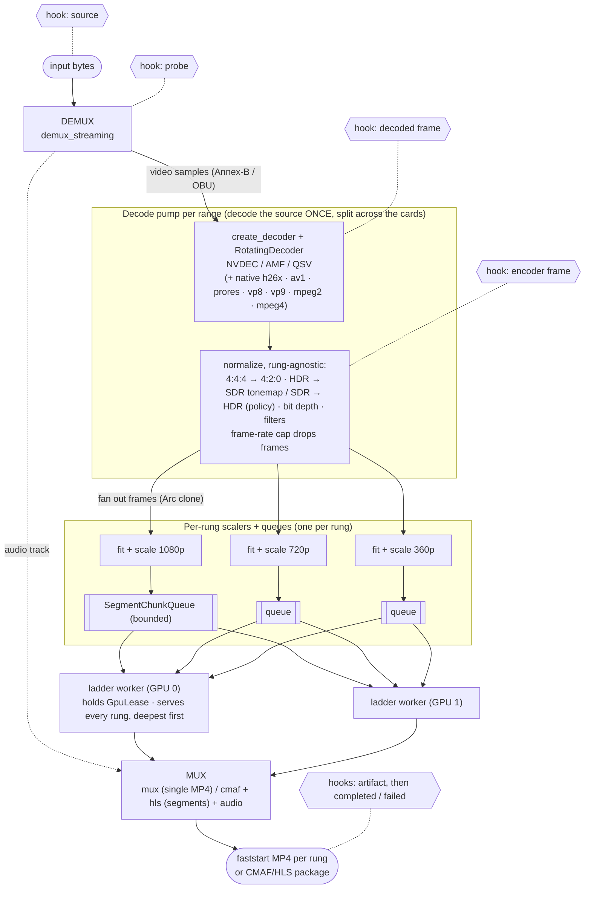
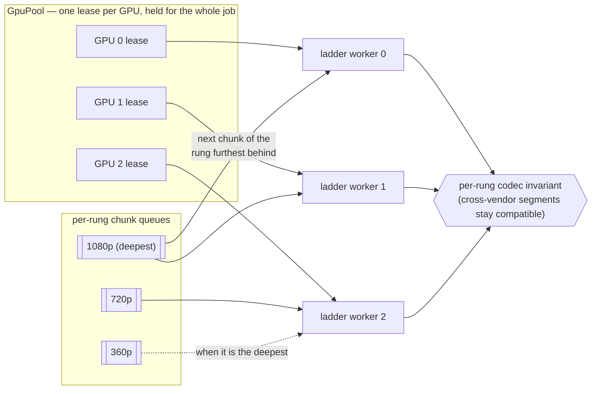

# rivet pipeline & architecture

How an input file becomes AV1 (default), H.264, or H.265 output — or an
audio-only file, or still images — end to end: the crates, the data flow, the
hook points, and where each piece lives. For the user-facing knobs see the
[CLI reference](cli.md) and [HTTP API reference](api.md); this document is the
"how it works" companion.

---

## Crate map

rivet is three transcoder crates over eleven shared ones, ten of them git
submodules. The generic
transcoding crates were extracted so they can be reused (and a standalone
`rivet` CLI/server built on top); [architecture.md](architecture.md#the-crates)
has the dependency graph.

| Crate | Role | Key modules |
|-------|------|-------------|
| **`container`** | Demux (in) + mux (out). Clean-room, no FFmpeg. | `streaming` (MP4/MKV/TS/AVI streaming demuxers, `demux_audio` for audio-only inputs), `mux` (faststart MP4), `cmaf` (fragmented-MP4 segments), `hls` (playlists), `annexb` (AVCC→Annex-B), `mp3` (bare `.mp3`), `metadata` (source metadata read / kept-subset write) |
| **`codec`** | Frame types, GPU decode/encode dispatch, colorspace, audio, probe. | `decode` (NVDEC/AMF/QSV, then the native software decoders — `h26x`, `av1`, `prores`, `vp8`, `vp9`, `mpeg2`, `mpeg4`), `encode` (NVENC/AMF/QSV + optional software `av1` / `h26x`; the native VP9 / VP8 / MPEG-2 / MPEG-4 / ProRes encoders always), `colorspace` (incl. `scale`) + `tonemap`, `filter`, `audio`, `gpu` (detection, PCI BAR report), `frame` (re-export of the `frame` crate) |
| **`rivet`** | The job engine + the multi-GPU reactive scheduler + the CLI/server. | `job`, `decode_pump`, `multigpu`, `gpu_pool`, `fit`, `rung_scaler`, `frame_queue`, `encoder_worker`, `spec`, `settings`, `ladder`, `progress`, `hooks`, `image` (`image` feature), `transcode` |
| `frame` | Value types `codec` and `container` share (`StreamInfo`, `VideoFrame`, `EncodedPacket`, colour metadata). | — |
| `h26x` (submodule) | Native H.264 / H.265 decoders and encoders. | — |
| `aac` (submodule) | AAC-LC encoder and decoder. | — |
| `ac3` (submodule) | AC-3 / E-AC-3 decoder. | — |
| `dts` (submodule) | DTS core decoder. | — |
| `lossless` (submodule) | FLAC and ALAC encoders and decoders. | `flac`, `alac`, and the shared `bits`, `lpc`, `pcm`, `layout` |
| `prores` (submodule) | ProRes decoder and encoder (rivet uses both). | — |
| `vp8` (submodule) | VP8 decoder and encoder (rivet uses both). | — |
| `vp9` (submodule) | VP9 decoder and profiles 0–3 encoder (rivet uses both; it encodes profiles 0 and 2). | — |
| `mpeg2` (submodule) | MPEG-2 / MPEG-1 video decoder and MPEG-2 encoder (rivet uses both). | — |
| `mpeg4` (submodule) | MPEG-4 Part 2 Visual decoder and encoder (rivet uses both). | — |
| `av1` (submodule) | AV1 decoder and encoder (the software AV1 tier both ways, and the AVIF encoder). | — |
| `png`, `jpeg`, `imagecodecs` (submodules) | PNG / APNG, JPEG, and GIF / BMP / TIFF decoders and encoders (still images, `image` feature). | — |

The hardware GPU paths in `codec` are all hand-rolled `dlopen` FFI in-tree (no
external wrapper crate); they build on Windows + Linux. See the
[README's compatibility matrix](../README.md#compatibility-matrix).

---

## End-to-end flow

The entry point is [`rivet::run_job`](../crates/rivet/src/job/mod.rs) (async) /
`run_job_blocking`, `rivet::run_splice_job` for several clips joined into one
output, or the one-shot `rivet::transcode_file`. `run_job` demuxes, fits the
rungs to the source, spins up the shared decode pump, fans out to per-rung work,
and assembles the requested
[`OutputMode`](../crates/rivet/src/spec/policy.rs). The hexagons are the
[hook](hooks.md) points (section 9). Two modes skip most of this diagram: an
audio-only job never touches video (section 7), and an image job is a separate
path (section 10).

---

## 1. Demux

`container::streaming::demux_streaming` dispatches on the container's magic bytes
to a per-format **streaming** demuxer (MP4/MOV, MKV/WebM, MPEG-TS, AVI incl.
OpenDML >1 GiB). Streaming = it yields one video sample at a time rather than
materialising the whole file, so peak RSS stays low. The demuxer's `DemuxHeader`
carries the codec string and the `StreamInfo` (width/height, frame rate, color
metadata, source pixel format) plus the container's rotation and the source's
sample aspect ratio; beside it are the audio track (with its edit list and any
gaps) and the subtitle tracks, and `next_video_sample` pulls video samples
already in the decoder-native bitstream form (Annex-B for H.264/HEVC, OBU for
AV1).

Source hooks run on the input bytes before this; probe hooks run once the
header is read, before anything is decoded. An input with no video track (a
bare MP3, an M4A, an audio-only Matroska) is not a ladder: a single-file job
becomes an audio-only one (section 7).

### Fitting the rungs

Before any decoding, `run_job` fits each rung to the source
([`crate::fit`](../crates/rivet/src/fit.rs)): a rung's `WxH` is a bounding box,
not the output size. The source's display shape — upright, its sample aspect
ratio applied, any crop/pad filters accounted for — meets the box per the
rung's `Fit` (`contain` by default, `cover`, `pad`, `stretch`), the box turns
with a portrait source unless the rung's orientation is `fixed`, a source
smaller than the box is not enlarged unless asked, and rungs that collapse onto
the same output are merged. The result is a `Placement` per rung (crop, scaled
size, offset, canvas) that the per-rung scaler applies (section 3). See
[output-spec.md](output-spec.md#fitting-the-source-into-a-rung).

## 2. Decode once — the shared pump

[`crate::decode_pump`](../crates/rivet/src/decode_pump.rs) is the heart of the
"rung benefit." **One pump per job, not per rung** (one per *range* when the
decode is split across cards, section 4): it decodes the source a single time,
runs the *rung-agnostic* per-frame work, and fans the normalized frame out to N
per-rung channels via a cheap `VideoFrame::clone()` (the pixel `Bytes` are
`Arc`-backed, so the clone is a refcount bump, not a copy).

A 5-rung ABR ladder therefore decodes the input **once, not five times** (the
naïve `ffmpeg`-per-rung approach decodes N times). The cost is backpressure: the
slowest rung (usually the largest, whose encoder is slowest) throttles the pump.

Per decoded frame, in order: the source's presentation edit and any trim decide
whether it is shown; under a frame-rate cap (`max_frame_rate` below the
source's rate) a frame no output period starts on is **dropped** — the
duration is kept and the motion gets coarser, rather than the picture being
slowed against its audio; decoded-frame hooks see the frame as the decoder made
it (upright); the frame is normalized; encoder-frame hooks see the normalized
frame; and it is fanned out. A frame no hook wants costs the hooks nothing.

### GPU decode dispatch

`codec::decode::create_decoder` tries the hardware decoders for the detected GPU
+ codec, in vendor order, then the software tiers, and **hard-fails** if none
matches:

1. **NVDEC** (`nvidia`) — hand-rolled CUVID; H.264/HEVC/AV1/VP8/VP9/MPEG-2/MPEG-4,
   10-bit P016. Skippable with `DISABLE_NVDEC` / `DISABLE_NVDEC_<CODEC>`.
2. **AMF** (`amd`) — hand-rolled AMF decode; H.264/HEVC/AV1/VP9.
3. **QSV** (`qsv`) — hand-rolled oneVPL 2.x decode (internal-allocation +
   `FrameInterface::Map`); H.264/HEVC/AV1/VP9, 10-bit P010.

4. **Native software decoders** (always compiled, pure Rust, one per codec) —
   the workspace's own `h26x` (H.264 / HEVC; `RIVET_DISABLE_H26X=1` skips
   it), `av1` (AV1, every layout and depth; on its own worker thread a few
   frames ahead, `RIVET_AV1_DECODE_THREAD=0` to decode inline), `vp8`, `vp9`,
   `mpeg2` (MPEG-2 and MPEG-1 video), `mpeg4` (MPEG-4 Part 2) and `prores`
   (ProRes), each written clean-room from its specification.

A hardware decoder that cannot start declines rather than failing the job, and
one that refuses its first sample hands over to the software tiers, replaying
the samples fed so far. Each backend implements the same `Decoder` trait
(`push_sample` → `decode_next`); `RotatingDecoder` wraps it so every frame
leaves upright. A GPU-less host decodes H.264/HEVC, AV1, ProRes, VP8, VP9,
MPEG-1/MPEG-2 and MPEG-4 Part 2 natively, and hard-fails on any other codec. See
[codec-decode.md](codec-decode.md#the-decode-dispatch--tiers).

### Rung-agnostic normalization

Done once in the pump, before fanout, because it's identical for every rung
(`FrameNormalizer` in `decode_pump.rs`, which the one-shot `transcode_bytes`
path and the per-title sample also use, so every entry point makes the same
picture of a source):
- **Source colour tag.** For H.264, HEVC, AV1, VP9 and MPEG-2 the frame is
  converted as the demuxer resolved the source's colour (container, else
  bitstream), not as the decoder tagged it — decoders disagree.
- **4:4:4 / 4:2:2 → 4:2:0** chroma downsample (output here is always 4:2:0).
- **HDR → SDR tonemap** — *only* when the [`ColorPolicy`](#6-color--bit-depth)
  says so. The default `TonemapToSdr` maps PQ/HLG BT.2020 down to 8-bit BT.709
  (`codec::tonemap` + `colorspace::convert_to_sdr_bt709`); `Passthrough`/`Hdr10`/
  `Hlg` keep it. The pump never tonemaps on its own — it's policy-driven. The
  kernel is AVX2/FMA with a scalar reference (runtime-dispatched, ≤ 1 LSB apart;
  ≈5.5× faster, see [codec-encode.md](codec-encode.md#tonemapping--the-single-output-policy)).
  On the same 8-bit SDR path a BT.601 / BT.2020-matrixed source is re-matrixed
  to BT.709, and `OutputSpec::resolve_output` tags the output `matrix_coefficients`
  1 to match (it used to pass the source's tag through, so an smpte170m source
  came out with BT.709 pixels and a smpte170m tag).
- **SDR → HDR** — an SDR source bound for an `Hdr10` / `Hlg` output is mapped
  into that signal (ITU-R BT.2408, `colorspace::SdrToHdr`) rather than only
  re-tagged.
- **Bit depth to the encoder's** — 12-bit sources (native HEVC Main 12 / RExt)
  are narrowed to 10 with rounding, and a 10-bit SDR source bound for an 8-bit
  output (or an 8-bit one bound for 10-bit) is narrowed / widened here, so the
  encoder only ever sees the `Yuv420p` / `Yuv420p10le` it was configured for
  (`colorspace::convert_bit_depth_frame`, `spec::encoder_input_format`).
- **Video filters** — the spec's [filter chain](filters/README.md) (crop / pad / flip /
  rotate / grayscale / image overlay / colour / denoise), applied last so every
  rung sees the transformed source. Overlay images are loaded once when the
  chain is prepared; each pump instantiates the chain per clip, so a temporal
  filter's frame history is never shared between streams.

## 3. Per-rung scale → chunk

[`crate::rung_scaler`](../crates/rivet/src/rung_scaler.rs): one scaler per rung
sits between the shared pump and that rung's encoder workers. It applies the
rung's `Placement` from section 1 — crop, bilinear resize and pad in one pass
(`colorspace::scale_region`; CPU, AVX2 where it pays off) — and groups K frames
into a `SegmentChunk` with a monotonic segment index, pushing them into the
rung's [`SegmentChunkQueue`](../crates/rivet/src/frame_queue.rs) (bounded — the
pump blocks when full, workers block when empty). For HLS, `K =
keyframe_interval` = one CMAF segment's worth; for multi-GPU single-file a
chunk is several GOPs, carrying a one-GOP lead-in margin replayed from the
previous chunk so its encoder starts warm. On pump close the scaler flushes the
final partial segment and closes the queue so workers drain cleanly (when the
decode is split, the last of the rung's scalers closes it).

## 4. The multi-GPU lease engine — the rung benefit

[`crate::multigpu`](../crates/rivet/src/multigpu/) schedules every rung's
segments across **all** detected GPUs:

- **One encoder per GPU at a time.** [`GpuPool`](../crates/rivet/src/gpu_pool.rs)
  hands out a `GpuLease` per slot; a ladder worker holds it for the whole job.
  This is load-bearing — concurrent NVENC sessions on one CUDA context were found
  to deadlock at ~session 5/5 init (2026-05-02), so the pool enforces
  one-encoder-per-GPU while still running encoders in parallel *across* GPUs.
- **Every worker serves every rung, deepest queue first.** A card idles only when
  the whole job is out of work — never because "its" rung is blocked while
  another rung's chunks wait — and no rung can be left without a consumer, so
  the ladder costs one decode however many rungs it has. Furthest-behind rather
  than cheapest-first because the shared pump stalls when *any* queue fills;
  draining the fullest is what keeps decode moving. (`--encode per-rung`,
  `EncodePolicy::PerRung`, pins each worker to its own rungs instead, as a
  control arm.)
- **The decode is split across the cards.** For an un-spliced, untrimmed
  H.264/H.265 source, `plan_decode_ranges` cuts it at keyframes that fall on
  segment boundaries — one range per GPU, each with its own pump — so the cards
  decode different stretches at the same time and the segment numbering stays
  continuous through the join. Anything unsplittable decodes whole, and so does
  a job with a frame-rate cap, a temporal filter, or software encode slots.
- **Cross-vendor codec invariant.** Cards of different *vendors* serve the same
  rung. The per-rung `RungCodecInvariant` guarantees every contributed segment
  shares the same codec-config contract (`av1C` for AV1, `avcC`/`hvcC` for
  H.264/H.265), so an NVENC + QSV mix on one rendition still decodes cleanly; a
  card that mismatches hands the chunk back and leaves that rung to the others.

Each unit of work is one chunk of one rung. For HLS the worker encodes its K
frames and writes one CMAF segment (a fresh `CmafVideoMuxer` per segment,
configured with the segment index + base decode time so filenames and `tfdt`
match a single-encoder pipeline). For multi-GPU single-file the same ladder
workers encode each chunk to packets in memory — on an encoder session the
worker keeps and resets between chunks, so every chunk opens on an IDR — and
each rung's finalizer stitches them, in order, into one stream
(chunk-and-stitch of one rendition). Workers exit when every queue is closed
and empty.

On a host with no usable encode silicon whose build has a software encoder for
the codec, the pool hands out **software slots** instead of cards — the same
lease discipline, each lease a share of the CPU (`GpuPool::software`).

### Encode dispatch

`codec::encode::select_encoder` tries, in order: the hand-rolled **NVENC**
(`nvidia`; AV1 needs Ada+) / **AMF** (`amd`; AV1 needs RDNA3+) / **QSV**
(`qsv`; AV1 needs Arc / Meteor Lake+) backends — either pinned to the lease's
vendor (that card first, then its siblings of the same vendor) or NVIDIA-first —
and then, only if the build opted in, **software**: the workspace's own `av1`
encoder for AV1 (`av1-sw-fallback`, 8- or 10-bit SDR) and the native `h26x`
encoders for H.264 / H.265 (`h26x-fallback`, up to 10-bit). AV1 (the default,
royalty-clean codec), H.264, or H.265; 4:2:0, 8- or 10-bit on hardware (H.264
is 8-bit on every hardware backend). The software tier sits *last*
deliberately: a build that has it must still prefer silicon, so it is a floor
rather than a shortcut. On a build without the software tier for the codec, if
no hardware can encode it, encoder construction is a hard error.
`build_output_caps()` / `build_output_caps_for(codec)` are the runtime
capability queries `OutputSpec::validate` consults;
`TRANSCODE_ENCODER_BACKEND=nvenc|amf|qsv|h26x|av1` forces a backend
(`rav1e` is still accepted for `av1`). See
[codec-encode.md](codec-encode.md).

## 5. Output modes

[`OutputMode`](../crates/rivet/src/spec/policy.rs) selects the shape:

- **`SingleFile`** — one self-contained faststart MP4 per rung (AV1, H.264, or H.265 video + audio).
  - With **one capable GPU**, `EncodePolicy::SingleGpu` (`--encode single` /
    `gpu:N`), an unknown frame count, a trim or a splice: the **serial** path
    ([`job/run.rs`](../crates/rivet/src/job/run.rs), `run_serial_single_file`)
    — one decode pump fanning out to a single encoder per rung, each muxing its
    own MP4.
  - With **multiple GPUs** (default `AllGpus`): the same `multigpu` engine
    chunk-encodes the one rendition at GOP boundaries across the GPUs and
    **stitches** the encoded packets back into one MP4. Each chunk is an independent
    IDR-led GOP so the result always plays. `ChunkSeamMode` controls quality
    across the seams — `Parallel` (fastest, NVENC chunks run VBR so seams
    can step) or `ParallelConstQp` (constant-QP, seam-flat, quality still
    tracks the target); the legacy `--seam-mode serial` means `--encode single`.
    See [CLI `--seam-mode`](cli.md#chunk-seams---seam-mode).
  - The one-shot [`crate::transcode`](../crates/rivet/src/transcode.rs) path
    (`transcode_bytes` / `transcode_file`, and `pipe` / `ipc` with no
    settings) is separate from the job engine: one encoder, source size, no
    spec.
- **`Hls`** — a CMAF/HLS package: `master.m3u8`, a shared audio rendition group
  (with a stereo downmix beside a surround track when asked), WebVTT subtitle
  renditions, and `video/<label>/{init.mp4, seg-*.m4s, playlist.m3u8}` per rung,
  **segment-aligned across the ladder** so hls.js does ABR cleanly. The `multigpu`
  orchestrator schedules every rung's segments across all GPUs, then `job`
  assembles the package (audio rendition + playlists via `container::hls`).
- **`AudioOnly`** — the audio alone as one file: an `.mp3`, or for lossless
  audio a native `.flac` or an `.m4a`. No video is decoded or encoded and there
  are no rungs. Also what a single-file job becomes when its input has no video.

Still images are not an `OutputMode`: `mode=image` builds an `ImageSpec` and
runs a separate job (section 10).

## 6. Color & bit depth

Two orthogonal axes on `OutputSpec`, with presets that bundle both:

| Axis | Type | Builder | Presets |
|------|------|---------|---------|
| Color (gamut + SDR/HDR transfer) | `ColorPolicy` | `with_color` | `.web_sdr()` (default) · `.hdr10()` · `.hlg()` · `.passthrough()` |
| Bit depth (bits per sample) | `BitDepth` | `with_bit_depth` | (HDR presets imply 10-bit) |

**Why two methods, not four?** The color knobs are exactly `with_color(ColorPolicy)`
and `with_bit_depth(BitDepth)` — there is *no* separate `with_gamut` /
`with_transfer` / `with_color_space`. `ColorPolicy` deliberately **bundles** two
things:

- **Gamut** — the color *primaries*, i.e. which colors are representable.
  **BT.709** (standard SDR) or **BT.2020** (wide, for HDR).
- **Transfer** — the *transfer function* (a.k.a. transfer characteristics /
  EOTF): the curve that maps stored pixel values ↔ actual light. SDR uses a
  gamma curve (~2.2/2.4); HDR uses **PQ** (SMPTE ST 2084, absolute brightness, up
  to 10k nits — HDR10) or **HLG** (ARIB STD-B67, relative — broadcast).

They're bundled because only a few (gamut, transfer, depth) combinations are
web-safe — BT.709+gamma+8-bit (SDR), BT.2020+PQ+10-bit (HDR10),
BT.2020+HLG+10-bit (HLG). Independent gamut/transfer setters would let you spell
nonsense (BT.709+PQ, wide-gamut SDR-gamma, …); the policy makes only the valid
combos expressible, and the presets (`.web_sdr()` / `.hdr10()` / `.hlg()`) name
the intent. Bit depth is the one genuinely orthogonal axis, so it gets its own
method.

`resolve_output(source_color, source_format)` collapses these against the source
into the concrete `(ColorMetadata, PixelFormat)` the encoder gets: `Hdr10`/`Hlg`
force BT.2020 + PQ/HLG and 10-bit (`yuv420p10le`); `BitDepth::Auto` derives depth
from the policy. `validate()` rejects incoherent combos (e.g. HDR with no 10-bit
encoder in the build). Full reference (every method + the color table):
[Configuring a transcode](output-spec.md#4-color--bit-depth).

## 7. Audio

Prepared once per job (`prepare_audio` in
[`job/audio.rs`](../crates/rivet/src/job/audio.rs)) and shared by every rung,
then interleaved into the output container. Under the default
`AudioCodecPolicy::Auto`:
- **Passthrough** (no re-encode): AAC, Opus, AC-3, E-AC-3, DTS — and MP3 into
  a single-file MP4 (at 16 kHz and up; CMAF has no MP3).
- **Transcode to Opus**: what can be decoded but not carried — MP3 for HLS,
  MP2, Vorbis, linear PCM, FLAC, ALAC, … — mono through 7.1.
- **Refused**: a track that can be neither carried nor decoded — a codec
  rivet has no reader or decoder for (the demuxer names it, with no packets),
  packets that will not read, a track the muxer refuses — fails the job by
  name. The output is never video-only unless `Drop` asked for that
  ([decision 42](decisions.md#42-a-source-with-audio-never-silently-becomes-a-video-only-output)).

The other policies force a codec, every encoder the workspace's own:
`ForceOpus`, `ForceMp3`, `ForceAac`, `ForceHeAac`, `ForceHeAacV2`,
`ForceVorbis` (WebM or Ogg only), `ForceAc3`, `ForceEac3`, `ForceDts` (up to
5.1), `Flac` / `Alac` (lossless) — a source already in that codec is copied —
and `Drop`. A forced codec the source cannot be decoded for falls back to
passing the source through where the output holds it. `audio-decode-deny`
names codecs that may not be decoded at all (passed through, or the job is
refused), `he-aac` chooses between decoding an HE-AAC track in full, only its
core, or not at all, and audio filters or a channel layout force a decode. See [output-spec.md](output-spec.md#3-audio--with_audioaudiocodecpolicy)
and [lossless-audio.md](lossless-audio.md).

An **audio-only** job (`OutputMode::AudioOnly`,
[`job/audio_only.rs`](../crates/rivet/src/job/audio_only.rs)) reads the track
with `container::streaming::demux_audio` and runs the same `prepare_audio`
toward the file it writes: an `.mp3` (an MP3 source passes through, with its
gapless tag), a native `.flac`, or an `.m4a`.

With `metadata_keep`, the source metadata categories it names (location,
capture time, device, descriptive tags) are written into single-file and
audio-only outputs; by default none are, and while the device category is not
kept a copied AAC or MP3 stream has the source encoder's name cleared.

## 8. Progress & the job engine

[`run_job`](../crates/rivet/src/job/mod.rs) streams a uniform
[`RungProgress`](../crates/rivet/src/progress.rs) per rung through a
[`ProgressSink`](../crates/rivet/src/progress.rs) — status (`Pending` → `Running`
→ `Finalizing` → `Completed`/`Failed`), percent, frames, segments, bytes. Wire
it to a closure (`fn_sink`), a Tokio mpsc channel (`channel_sink`), or your own
impl. The same events back the CLI's progress bars and the HTTP API's
job-status polling.

## 9. Hooks

A spec's [hooks](hooks.md) ([`crate::hooks`](../crates/rivet/src/hooks/mod.rs))
run at fixed points, each handed what exists there; any can reject the job, and
what they record comes back as `JobOutput::hooks`. Where each is emitted:

| Point | Video job (`run_job` / `run_splice_job`) | Audio-only job | Image job |
|-------|-------------------------------------------|----------------|-----------|
| source | `run_job`, before the input is parsed (each clip of a splice) | same | `run_image_job_with_hooks`, before the input is read |
| probe | `run_job_inner` once demuxed and the rungs fitted (each clip of a splice) | `audio_only::run`, once the track is read | on the image's header, or the video's probe |
| decoded frame | the decode pump, before `FrameNormalizer` | — | — |
| encoder frame | the decode pump, after `FrameNormalizer`, before per-rung scaling | — | — |
| still | — | — | each decoded image, or each still taken from a video |
| artifact | each single-file output, HLS rendition directory and master playlist, before the job returns | the audio file | each encoded image |
| completed / failed | last, after the artifacts; failed on any error, a rejection included | same | same |

The frame hooks are sampled (`FrameSampling`), so a frame no hook wants costs
nothing; they fire in every pump, so on a split decode they fire from several
threads. A **blocking** hook runs on the thread that reached its point; a
**background** hook runs on the session's one worker thread, fed through a
bounded queue, and the job waits for it before it returns. The `hooks::frame`
helpers turn a frame into model input (8-bit RGB, resized or letterboxed,
planar `f32`) reading only the source samples the output needs, straight from
the decoder's planes, so their cost follows the model's input size rather than
the frame's. The HTTP API runs the
server's configured hooks and lists them at `GET /v1/hooks`
([api.md](api.md)).

## 10. Still images

With the `image` feature, `mode=image` is a separate job:
[`rivet::image::run_image_job`](../crates/rivet/src/image/mod.rs) (the CLI's
`rivet image`; settings build an `ImageSpec` through
`TranscodeSettings::into_image_spec`). It sniffs the input:

- **An image** (JPEG, PNG, WebP — an animation's first frame — AVIF, GIF's
  first frame, TIFF, BMP, HEIC/HEIF) is decoded in `image::decode`, on the workspace's own codecs — HEIC and AVIF through the same
  HEVC / AV1 decoder dispatch as video (`image::heif`). `image-decode-deny`
  refuses a format by name.
- **A video** gives stills (`FrameSelection`: a poster frame 10% in, N evenly
  spaced, or at given times) through the thumbnail capture path
  (`thumbnail::capture_frames`), not the decode pump.

Each picture is turned upright, converted to sRGB (or keeps its ICC profile
with `keep-icc`), fitted to every rendition with the same
[`crate::fit`](../crates/rivet/src/fit.rs) rules as a video rung (on a
one-pixel grid), and encoded to each requested format — AVIF, JPEG, PNG.
No source metadata reaches an output unless `metadata_keep` names a category,
in which case a fresh EXIF block holding only that is written. See
[output-spec.md](output-spec.md#11-still-images--modeimage).

---

## Where to look in the code

| You want to understand… | Start here |
|-------------------------|------------|
| The whole job flow | `crates/rivet/src/job/mod.rs` (`run_job`), `job/run.rs` (single-file), `job/pump.rs` (`run_hls`) |
| Decode-once + fanout | `crates/rivet/src/decode_pump.rs` |
| Rung fitting | `crates/rivet/src/fit.rs` |
| GPU decode/encode dispatch | `crates/codec/src/decode/mod.rs`, `crates/codec/src/encode/mod.rs` |
| Multi-GPU scheduling | `crates/rivet/src/multigpu/` (`ladder.rs` is the core) + `gpu_pool.rs` + `frame_queue.rs` + `rung_scaler.rs` + `encoder_worker/` |
| Single-file one-shot | `crates/rivet/src/transcode.rs` |
| Audio, audio-only | `crates/rivet/src/job/audio.rs`, `crates/rivet/src/job/audio_only.rs` |
| Output spec / presets | `crates/rivet/src/spec/` |
| Hooks | `crates/rivet/src/hooks/` |
| Still images | `crates/rivet/src/image/` |
| Demuxers / muxers | `crates/container/src/` |
| Color / tonemap | `crates/codec/src/colorspace/`, `crates/codec/src/tonemap.rs` |
